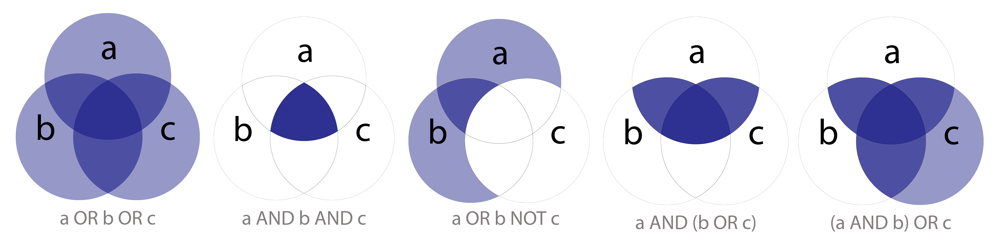

# Introduction

The initial step in any bibliometric study is one of logic, primarily Boolean logic (Figure 1), used to ensure that the bulk of those publications harvested in the study are relevant to the question at hand. In this case, *geometric morphometrics in archaeology* is the topic of interest; thus, the query employed for this study was _"geometric morphometric" AND (archeology OR archaeology)_, which yielded 103 results in Scopus.



## PRISMA

While neither a formal systematic review or a meta-analysis his study enlisted the work-flow of the Preferred Reporting Items for Systematic Reviews and Meta-Analysese (PRISMA) [@RN20925], as a means of improving reporting. There is no shortage of unindexed publications on the topic in question; however, the focus of this particular study relied only on those works included in Scopus, which includes a complementary record with the cited works for each publication.

```{r}
# PRISMA flow diagram
install.packages("PRISMAstatement") #if not installed, remove the hash at the beginning of this line
library(PRISMAstatement)
prisma(found = 103,
       found_other = 0,
       no_dupes = 103, 
       screened = 103, 
       screen_exclusions = 1, 
       full_text = 102,
       full_text_exclusions = 0, 
       qualitative = 102, 
       quantitative = 102)
```


